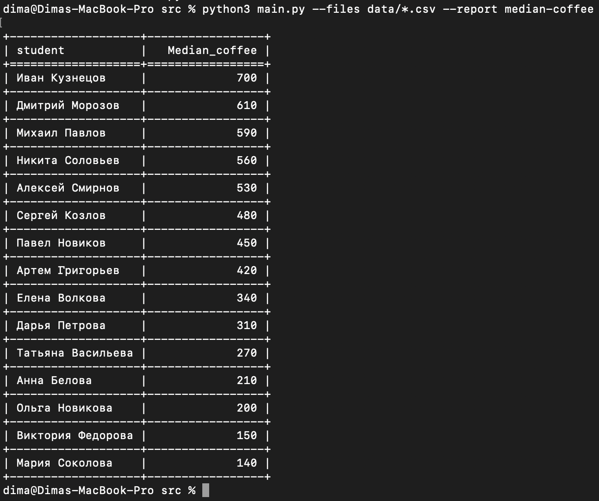

# Структура проекта

В папке `src/` находиться весь рабочий код по пути `src/data` лежать тестовые `.csv` файлы.
Также в корне проекта есть файл `requirements.txt` для установки нужных зависимостей.

- Реализован отчёт `median-coffee`, который рассчитывает медианные траты на кофе по каждому студенту за весь период (по всем переданным файлам) и выводит результат в виде таблицы, отсортированной по убыванию.
- Поддерживается добавление новых отчётов через декоратор `@Reports.registry`. Декоратор нужно добавлять к той функции, которая будет обрабатывать новый репорт, также эту функцию нужно импортировать в `main.py`.
- Декоратор принимает два обязательных параметра


```python
@Reports.registry(name="имя репорта",headers=["заголовки для результирующей таблице"])
```

## Пример работы




